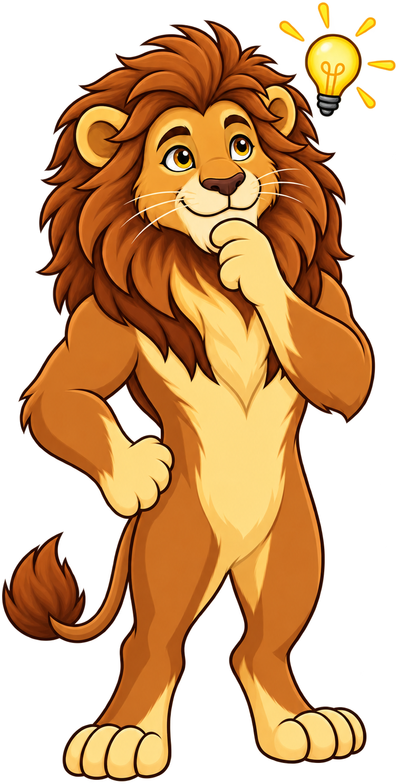

# Storytelling Fundamentals & Psychology

## Summary

This chapter covers 25 concepts related to storytelling fundamentals & psychology. Students will learn the key principles and practical applications relevant to these topics.

## Concepts Covered

This chapter covers the following 25 concepts from the learning graph:

|| Concept | Concept Impact Score |
||---------|-----------------------|
|| Storytelling Fundamentals | 79 |
|| Hero's Journey | 1 |
|| Story Arc | 3 |
|| Narrative Structure | 1 |
|| Story Conflict | 1 |
|| Story Resolution | 1 |
|| Emotional Resonance | 5 |
|| Memory Retention | 14 |
|| Working Memory | 1 |
|| Long-Term Memory | 4 |
|| Episodic Memory | 2 |
|| Semantic Memory | 1 |
|| Story Memory Effect | 1 |
|| Neural Coupling | 1 |
|| Narrative Transportation | 1 |
|| Story Identification | 1 |
|| Emotional Connection | 1 |
|| Cognitive Ease | 8 |
|| Decision Fatigue | 7 |
|| Choice Architecture | 6 |
|| Anchoring Effect | 1 |
|| Availability Heuristic | 1 |
|| Confirmation Bias | 1 |
|| Loss Aversion | 1 |
|| Status Quo Bias | 1 |

## Prerequisites

This chapter builds on concepts from:
- [Chapter 1: Challenger Sales Methodology & Insights](../01-challenger-methodology-insights/index.md)

---

!!! mascot-welcome "The Power of Story"
    { class="mascot-admonition-img" }
    Now that you understand the Challenger methodology, let's unlock its full potential with storytelling. Stories make your insights unforgettable and actionable. Let's craft a story!

## Why Storytelling Matters in Sales

In Chapter 1, you learned that Challengers teach customers something new about their business. But teaching alone isn't enough—customers must remember what they learned and act on it. This is where storytelling becomes essential. Research consistently shows that stories are more memorable than facts, more persuasive than arguments, and more motivating than statistics.

When you deliver a Challenger insight without a story, you provide information. When you wrap that insight in a story, you create an experience. The difference is profound. Information competes for attention in an already-crowded mind. An experience engages the whole brain—emotions, imagination, and logic working together. Sales professionals who master storytelling don't just communicate better—they change how customers think, feel, and decide.

The Challenger methodology and storytelling are not separate skills. They're complementary. The Challenger methodology provides the insight—what customers need to learn. Storytelling provides the vehicle—how that insight sticks. The best Challengers are also the best storytellers, not because they're naturally gifted, but because they understand the psychology behind why stories work and apply it systematically.

## Storytelling Fundamentals

Storytelling Fundamentals encompass the core principles that make stories effective across cultures, contexts, and media. While stories take countless forms, from ancient myths to modern case studies, they share common structural elements and psychological effects. Understanding these fundamentals lets you craft stories that reliably engage attention, build understanding, and drive action.

At its simplest level, a story is a sequence of events involving characters who face challenges and undergo change. But this definition misses what makes stories powerful. Effective stories create narrative tension, invite the audience into the experience, and provide emotional resolution. They don't just recount events—they shape how the audience interprets those events.

In sales contexts, storytelling isn't about entertainment. It's about communication. Your stories serve specific purposes: reframing customer problems, demonstrating value, building trust, and guiding decisions. The fundamentals help you achieve these purposes efficiently rather than relying on intuition or talent.

### Hero's Journey

The Hero's Journey is a universal story structure identified by mythologist Joseph Campbell. It describes a pattern found in myths and stories across cultures: a hero leaves their ordinary world, faces trials and challenges, gains wisdom, and returns transformed. While the Hero's Journey is often associated with epic narratives, its structure appears in everyday sales stories as well.

The Hero's Journey framework includes stages like the call to adventure, meeting mentors, facing tests, achieving a transformation, and returning with the elixir—a gift or insight that benefits the community. In sales stories, the "hero" is often the customer, the "call to adventure" is the recognition of a problem, the "trials" are implementation challenges, and the "elixir" is the business outcome achieved with your solution.

While you don't need to rigidly apply every stage of the Hero's Journey to every sales story, understanding this pattern helps you recognize when your stories have sufficient drama and resolution. A story without challenges lacks tension. A story without transformation lacks meaning. The Hero's Journey reminds you that effective stories involve change and growth.

#### Diagram: Hero's Journey Interactive Map

<iframe src="../../sims/heros-journey-interactive-map/main.html" width="100%" height="502px" scrolling="no"></iframe>
[Run Hero's Journey Interactive Map Fullscreen](../../sims/heros-journey-interactive-map/main.html)

Hero's Journey Interactive Map

Type: infographic
**sim-id:** heros-journey-interactive-map 
**Library:** html 
**Status:** Built 
**Bloom Level:** Understand 
**Bloom Verb:** explain 
**Learning Objective:** The learner will explain the stages of the Hero's Journey and how they apply to sales storytelling.

**Prerequisites:** Hero's Journey concept defined in the section above.

**Evidence of Mastery:** The learner clicks each stage to reveal its description and sales application. The learner then answers "Which stage represents the customer recognizing they have a problem that needs solving?" (correct answer: Call to Adventure). The learner must answer 3 of 3 questions correctly on the first attempt.

**Misconceptions:** (1) The Hero's Journey is only for epic myths (it applies to everyday sales stories too). (2) All stages must be included in every story (stories can use simplified versions). (3) The hero is always the salesperson (in sales stories, the customer is often the hero).

**Instructional Rationale:** An interactive map with clickable stages allows the learner to explore the Hero's Journey structure at their own pace and see how it applies to sales contexts. This supports the Understand objective by enabling exploration followed by comprehension testing.

**Content:**

A circular or linear diagram showing the Hero's Journey stages. Each stage is clickable:

**Ordinary World:** Click reveals: The customer's current state before change. In sales, this is the status quo where the customer uses legacy systems or processes. This stage establishes the baseline.

**Call to Adventure:** Click reveals: The recognition of a problem or opportunity. The customer realizes they need to change. In sales, this is when the customer becomes aware of a challenge your solution addresses.

**Refusal of the Call:** Click reveals: Initial resistance to change. The customer hesitates or questions whether action is needed. In sales, this is the customer's skepticism or objections.

**Meeting the Mentor:** Click reveals: Encountering a guide who provides expertise. The customer meets a trusted advisor (you) who shows the path forward. In sales, this is when you establish credibility and provide guidance.

**Crossing the Threshold:** Click reveals: Committing to the journey. The customer decides to take action. In sales, this is when the customer agrees to a pilot or demonstration.

**Tests, Allies, Enemies:** Click reveals: Facing challenges during implementation. The customer encounters obstacles, finds allies, and deals with opponents. In sales, this is the implementation phase with its challenges.

**Approach to the Inmost Cave:** Click reveals: The final challenge. The customer faces the most difficult part of the change. In sales, this is the critical decision point or final implementation hurdle.

**The Ordeal:** Click reveals: The climax of the journey. The customer overcomes the final challenge. In sales, this is when the solution is fully implemented and working.

**Reward (Seizing the Sword):** Click reveals: Achieving the outcome. The customer gains the benefit of the change. In sales, this is when the customer achieves the business result.

**The Road Back:** Click reveals: Returning to ordinary life with the elixir. The customer integrates the change into their operations. In sales, this is when the solution becomes part of standard operations.

**Return with the Elixir:** Click reveals: Sharing the benefit with others. The customer's success benefits the organization. In sales, this is when the success becomes a case study that influences others.

Quiz questions (randomized order):
1. Which stage represents the customer recognizing they have a problem? (Options: Ordinary World, Call to Adventure, Meeting the Mentor, Reward; correct: Call to Adventure)
2. In sales storytelling, who is typically the "hero"? (Options: The salesperson, the customer, the competitor, the mentor; correct: The customer)
3. Which stage corresponds to the customer agreeing to a pilot project? (Options: Refusal of the Call, Crossing the Threshold, The Ordeal, Return with the Elixir; correct: Crossing the Threshold)

**Provenance:** The Hero's Journey stages are from Joseph Campbell's monomyth theory. The sales applications are adapted from Challenger methodology applications.

**Rules:** The learner can click stages in any order. Quiz questions appear after all stages have been clicked. One attempt per question. Correct answer shows "Correct" with explanation; incorrect answer shows "Not quite" with correct answer and explanation.

**Learner Activity:**
1. The learner clicks each stage to reveal its description and sales application.
2. After all stages are revealed, three quiz questions appear one at a time.
3. The learner selects an answer for each question.
4. After answering all three, the learner sees their score and can retry.

**Feedback:**
- Question 1: Correct - "Right! The Call to Adventure is when the customer recognizes the problem." Incorrect - "Not quite. The Call to Adventure is the recognition of the problem."
- Question 2: Correct - "Exactly! In sales stories, the customer is the hero on a journey." Incorrect - "Not quite. The customer is typically the hero in sales stories."
- Question 3: Correct - "Yes! Crossing the Threshold is committing to action like a pilot." Incorrect - "Not quite. Crossing the Threshold is when the customer commits to the journey."

**Starting State:** The learner sees a diagram with labeled stages. A prompt says "Click each stage to learn about the Hero's Journey." No quiz questions visible yet.

**Chapter Anchors:** The Hero's Journey concept is defined in the section above. The sales applications are adapted from the chapter's teaching about applying storytelling to Challenger insights.

### Story Arc

A Story Arc is the trajectory of a narrative from beginning to end—the shape of the story's tension and release. While stories vary widely in content, they typically follow recognizable arc patterns: a setup that establishes context, rising action that builds tension, a climax that represents the peak of conflict, and falling action that resolves toward an ending.

In sales storytelling, the arc often mirrors the customer's journey: the current state (setup), the problem or opportunity (rising action), the decision point (climax), and the outcome with your solution (resolution). The arc matters because it controls pacing and engagement. A story that stays flat lacks momentum. A story that builds tension without release frustrates the audience.

Understanding story arcs helps you structure case studies and success stories effectively. Don't just list facts and outcomes—build the narrative. Show what the customer faced before they adopted your solution, the challenges they encountered during implementation, and the specific results they achieved. The arc turns a dry case study into a compelling story that other customers can see themselves in.

#### Diagram: Story Arc Builder

<iframe src="../../sims/story-arc-builder/main.html" width="100%" height="772px" scrolling="no"></iframe>
[Run Story Arc Builder Fullscreen](../../sims/story-arc-builder/main.html)

Story Arc Builder

Type: infographic
**sim-id:** story-arc-builder 
**Library:** html 
**Status:** Built 
**Bloom Level:** Apply 
**Bloom Verb:** construct 
**Learning Objective:** The learner will construct a story arc by sequencing story elements (setup, rising action, climax, resolution) for a given sales scenario.

**Prerequisites:** Story Arc concept defined in the section above.

**Evidence of Mastery:** The learner is presented with a sales scenario with 4 story elements out of order. The learner drags and drops the elements into the correct arc sequence. The learner must correctly sequence all elements.

**Misconceptions:** (1) All stories follow the same arc pattern (different stories can use different arc structures). (2) The climax always comes at the end (the climax is the peak of tension, followed by resolution). (3) Setup is unimportant (setup establishes context and stakes).

**Instructional Rationale:** An interactive builder allows the learner to apply story arc knowledge by sequencing elements. This supports the Apply objective by requiring the learner to construct a proper narrative structure.

**Content:**

Scenario: "You're telling a story about a manufacturing company that adopted your IoT platform. Arrange these story elements in the correct arc sequence:"

Story elements (shuffled):
- "After implementation, the company reduced downtime by 60% and improved product quality by 25%."
- "The company's legacy systems were causing frequent unplanned downtime, costing $2M annually in lost production."
- "The CTO approved a 3-month pilot after seeing a competitor gain market share through better reliability."
- "The pilot required retraining staff, integrating with existing systems, and managing stakeholder resistance."

The learner drags each element to its correct position in the arc diagram:

**Setup:** [Correct element: The company's legacy systems were causing frequent unplanned downtime, costing $2M annually in lost production.]

**Rising Action:** [Correct element: The pilot required retraining staff, integrating with existing systems, and managing stakeholder resistance.]

**Climax:** [Correct element: The CTO approved a 3-month pilot after seeing a competitor gain market share through better reliability.]

**Resolution:** [Correct element: After implementation, the company reduced downtime by 60% and improved product quality by 25%.]

After sequencing, the learner sees a graph showing the tension curve building through the arc.

**Provenance:** The story arc structure is from narrative theory. The scenario is illustrative for an IoT platform sale.

**Rules:** The learner must place all 4 elements before submitting. Elements can be rearranged by dragging. The learner sees immediate feedback on whether the sequence is correct.

**Learner Activity:**
1. The learner reads the scenario and the 4 story elements.
2. The learner drags each element to a position in the arc diagram (Setup, Rising Action, Climax, Resolution).
3. The learner submits their sequence.
4. The system shows whether the sequence is correct and displays the tension curve.
5. If incorrect, the learner can rearrange and resubmit.

**Feedback:**
- Correct sequence: "Correct! Your story arc builds tension effectively. Here's the tension curve showing how engagement rises through the arc."
- Incorrect sequence: "Not quite. The story arc should build tension, not resolve it too early. Try rearranging the elements to create better narrative flow."

**Starting State:** The learner sees the scenario description and 4 draggable story elements. The arc diagram has 4 empty slots labeled Setup, Rising Action, Climax, Resolution.

**Chapter Anchors:** The story arc concept is defined in the section above. The scenario is illustrative for an IoT sales context, connecting to later chapters on technical products.

### Narrative Structure

Narrative Structure refers to how a story is organized—the sequence of events, the relationship between cause and effect, and the way information is revealed to the audience. Good narrative structure creates clarity and coherence. The audience should always understand where they are in the story and why it matters.

Common narrative structures include chronological order (events told in the sequence they occurred), flashback (starting with the outcome and revealing how it was achieved), and parallel narratives (telling two related stories simultaneously). In sales contexts, chronological structure often works best for case studies, while flashback structure can be effective for success stories that start with impressive results.

The key principle is that narrative structure should serve the story's purpose. If you want to demonstrate process reliability, use chronological structure. If you want to create immediate interest, start with the most dramatic moment and then explain. Choose your structure deliberately rather than defaulting to the same pattern every time.

### Story Conflict

Story Conflict is the central problem or tension that drives a narrative forward. Without conflict, there is no story—only a sequence of events. Conflict creates stakes: the audience cares about the outcome because something important is at risk. In sales stories, conflict typically takes the form of business challenges, competitive pressures, or operational problems.

Effective conflict isn't just about stating a problem—it's about showing why the problem matters. A customer struggling with slow database queries isn't just a technical issue; it's a business problem that delays product launches, frustrates developers, and costs revenue. The more clearly you articulate the stakes of the conflict, the more engaged your audience will be.

When crafting sales stories, look for conflicts that your target audience recognizes. If you're selling to CFOs, frame conflict in terms of financial risk. If you're selling to CTOs, frame conflict in terms of technical debt and obsolescence. The conflict should feel real and urgent to the specific stakeholder you're addressing.

### Story Resolution

Story Resolution is how the conflict is resolved—the outcome of the narrative. A satisfying resolution answers the questions raised by the conflict and provides closure. In sales stories, resolution typically involves the customer achieving a meaningful outcome with your solution.

Good resolution shows cause and effect. Don't just state that the customer saved money—show how your solution specifically addressed the conflict and produced that result. If the conflict was slow product launches, the resolution should show faster launches with specific metrics: time-to-market reduced by 40%, three products launched in six months instead of one.

Resolution also often includes learning or insight—the "lesson" of the story. What did the customer learn from the experience? What would they do differently? This reflection makes the story more relatable and provides practical guidance that other customers can apply.

## The Psychology of Memory and Stories

Stories are powerful because they align with how human memory works. Understanding the psychology of memory explains why stories stick when facts fade, and it provides principles for crafting more memorable communications. The Challenger methodology teaches customers something new—storytelling ensures they remember it.

### Memory Retention

Memory Retention is the ability to store and retrieve information over time. Research consistently shows that stories improve memory retention compared to fact-based presentations. When information is embedded in a narrative, it's more likely to be encoded into long-term memory and recalled later.

One reason stories enhance retention is that they create multiple memory associations. A story about a customer struggling with slow product launches creates associations with time pressure, competitive risk, team frustration, and eventual success. Each of these associations provides a retrieval cue—when any part of the story comes to mind, the whole story is more likely to be recalled.

Another reason is that stories engage emotion, and emotion strengthens memory formation. Emotionally charged experiences are more deeply encoded in memory than neutral ones. A story that shows the personal impact of a business problem—teams working late, executives under pressure, customers waiting—creates emotional connections that make the information more memorable.

#### Diagram: Memory Retention Experiment

<iframe src="../../sims/memory-retention-experiment/main.html" width="100%" height="642px" scrolling="no"></iframe>
[Run Memory Retention Experiment Fullscreen](../../sims/memory-retention-experiment/main.html)

Memory Retention Experiment

Type: infographic
**sim-id:** memory-retention-experiment 
**Library:** html 
**Status:** Built 
**Bloom Level:** Understand 
**Bloom Verb:** compare 
**Learning Objective:** The learner will compare memory retention between story-based and fact-based presentations to understand why stories enhance memory.

**Prerequisites:** Memory Retention concept defined in the section above.

**Evidence of Mastery:** The learner participates in a simulated memory experiment. The learner sees two presentations (one story-based, one fact-based) then answers recall questions. The learner observes that story-based information is better remembered. The learner must correctly answer 3 of 3 recall questions.

**Misconceptions:** (1) All information is remembered equally (emotional and narrative content is better remembered). (2) Facts are always more memorable than stories (stories provide retrieval cues that facts lack). (3) Memory is all about repetition (emotion and narrative structure enhance memory even without repetition).

**Instructional Rationale:** A simulated experiment allows the learner to experience the Story Memory Effect firsthand. This supports the Understand objective by demonstrating the difference between story-based and fact-based memory retention.

**Content:**

The learner is told: "You'll see two presentations about the same topic: one as a story, one as facts. Then you'll answer recall questions to compare memory retention."

**Presentation A (Story-based):**
A brief story: "Sarah, a manufacturing VP, was frustrated. Her team worked weekends to fix equipment failures, but customers complained about delays. After adopting predictive maintenance, downtime dropped 60% and her team finally had weekends back. The ROI was $5M in the first year."

**Presentation B (Fact-based):**
Bullet points: "Predictive maintenance reduces equipment downtime by 60%. Manufacturing companies see average ROI of $5M in the first year. 80% of companies report improved team satisfaction after implementation."

After reading both presentations, the learner answers recall questions:

**Question 1:** "What was the ROI mentioned in the presentations?" (Options: $5M, $3M, $10M; both presentations mentioned $5M)
**Question 2:** "What was the percentage reduction in downtime?" (Options: 60%, 40%, 80%; both mentioned 60%)
**Question 3:** "What personal detail from the story do you remember?" (Options: Sarah's role, her team worked weekends, the customer complaints; story-specific details)

The learner sees their results: Story-based presentation was recalled more accurately for Question 3 (which had a story-specific answer). The learner sees a graph showing typical research results: stories are remembered 22% better than facts on average.

**Provenance:** The Story Memory Effect research shows 22% better recall for narrative vs. factual information. The scenario is illustrative but reflects real research findings.

**Rules:** The learner must answer all 3 questions before seeing results. The learner can retake the experiment with different scenarios to see consistent results.

**Learner Activity:**
1. The learner reads Presentation A (story-based).
2. The learner reads Presentation B (fact-based).
3. The learner answers 3 recall questions.
4. The learner sees their results and the research comparison graph.
5. The learner can repeat the experiment with new content.

**Feedback:**
- After answering: "You correctly answered X of 3 questions. Story-based presentations are typically remembered 22% better than fact-based ones according to research."
- Graph explanation: "The graph shows that narrative information creates more memory associations and emotional engagement, leading to better recall."

**Starting State:** The learner sees instructions, then Presentation A, then Presentation B, then 3 questions. Results and graph appear after answering.

**Chapter Anchors:** The Memory Retention concept is defined in the section above. The experimental scenario is illustrative but reflects research on the Story Memory Effect.

!!! mascot-thinking "The Memory Advantage"
    { class="mascot-admonition-img" }
    Think about the last presentation you remember vividly. Was it a slide deck with bullet points, or did it tell a story? Stories don't just add color to your Challenger insights—they fundamentally change how your customers' brains process and store information.

#### Working Memory

Working Memory is the cognitive system that temporarily holds and manipulates information. It's like mental workspace with limited capacity—typically able to hold only a few pieces of information at once. When working memory is overloaded, understanding and retention suffer.

Stories help manage working memory constraints by organizing information into a coherent structure. Instead of presenting a list of disconnected facts, a story provides a framework that connects them logically. This reduces the cognitive load on working memory because the narrative structure provides retrieval cues and organizational support.

In sales presentations, overloading working memory is a common problem. Presentations packed with statistics, features, and technical details exceed what most audiences can process effectively. Storytelling provides a way to deliver the same information in a more digestible form by embedding facts within a narrative that the audience can follow more easily.

#### Long-Term Memory

Long-Term Memory is the relatively permanent storage of information over extended periods. Information moves from working memory to long-term memory through a process called consolidation, which involves rehearsal, meaningful association, and emotional significance.

Stories facilitate the transfer to long-term memory by creating meaningful associations. When information is presented in the context of a story, it's connected to other elements of the narrative—the characters, the setting, the conflict, the resolution. These multiple connections make the information more robust in long-term memory and more likely to be retrieved later.

From a sales perspective, this means that customers are more likely to remember your Challenger insights when they're embedded in stories. An insight about data infrastructure costs might be forgotten if presented as a statistic, but remembered when framed as part of a story about a competitor launching products faster because they addressed the same issue.

#### Episodic Memory

Episodic Memory is the memory system that stores personal experiences and events—your memory of specific times, places, and situations. When you remember your first day at a new job, you're using episodic memory. Episodic memory is distinct from semantic memory, which stores general knowledge and facts.

Stories engage episodic memory because they simulate experiences. When you hear a story, your brain processes it similarly to how it processes an actual experience. The regions of the brain associated with sensory perception, emotion, and spatial awareness activate as if you were living through the events of the story.

This is why stories are so effective in sales. A case study about a customer overcoming a challenge isn't just abstract information—it's a simulated experience that engages the customer's episodic memory. The customer doesn't just remember the facts; they remember the experience of hearing the story, which makes the information more vivid and accessible.

#### Semantic Memory

Semantic Memory stores general knowledge and facts that aren't tied to specific personal experiences. When you know that Paris is the capital of France, you're using semantic memory. Semantic memory is organized in networks of related concepts—how concepts connect to each other and what they mean.

Stories enhance semantic memory by creating connections between concepts. A story about a customer's journey creates links between concepts like "data infrastructure," "product development," "time-to-market," and "competitive advantage." These connections strengthen semantic memory by embedding new information within existing knowledge networks.

For sales professionals, this means that stories help customers integrate your insights into their existing understanding of their business. Rather than presenting isolated facts, stories show how those facts relate to each other and to concepts the customer already knows. This integration makes the information more meaningful and easier to retrieve.

#### Story Memory Effect

The Story Memory Effect is the phenomenon that information presented in narrative form is better remembered than information presented in non-narrative form. Research across fields confirms this effect: people recall stories more accurately than lists of facts, even when the stories and lists contain identical information.

Several mechanisms contribute to the Story Memory Effect. Stories provide structure and organization that aids encoding. Stories create emotional engagement that strengthens memory formation. Stories create retrieval cues that make information easier to access later. Together, these mechanisms make narrative a powerful tool for communication.

In sales, the Story Memory Effect is a strategic advantage. When you wrap your Challenger insights in stories, you're not just making your presentation more engaging—you're increasing the likelihood that customers will remember and act on your insights days or weeks after your meeting.

#### Neural Coupling

Neural Coupling is the phenomenon where the brain activity of a listener mirrors the brain activity of a storyteller. When someone tells a story, the listener's brain activity synchronizes with the storyteller's brain activity in regions associated with language comprehension, emotion, and sensory processing.

This coupling suggests that stories create a form of shared experience between storyteller and listener. The listener doesn't just understand the story—they simulate it in their own mind, activating similar neural patterns as the storyteller. This shared experience builds connection and empathy.

For sales professionals, neural coupling provides a scientific basis for why storytelling builds rapport. When you tell a story effectively, you're not just communicating information—you're creating a shared mental experience with your customer. This experience can strengthen trust and make your insights more persuasive.

#### Narrative Transportation

Narrative Transportation is the psychological state of being immersed in a story—when the audience is so engaged that they lose awareness of their surroundings and become absorbed in the narrative. Transported audiences are more likely to be persuaded by the story and to remember it later.

Several factors increase narrative transportation: vivid imagery, emotional engagement, relatable characters, and a compelling plot. Stories that create transportation don't just hold attention—they temporarily suspend the audience's critical distance, making them more open to the story's message.

In sales contexts, narrative transportation is valuable because it lowers resistance. When customers are transported by a story about a peer's success, they're less likely to raise objections or scrutinize claims skeptically. The story's persuasive power comes through the immersive experience rather than through argument.

#### Story Identification

Story Identification is the audience's ability to see themselves in the story—to relate to the characters and situations. When customers identify with a story, they imagine themselves facing similar challenges and achieving similar outcomes. This identification increases the story's relevance and persuasiveness.

To create identification, stories should feature characters and situations that mirror the customer's reality. A story about a CTO at a similar-sized company facing similar challenges will resonate more with a CTO than a story about a completely different role or industry. The more specific and relatable the story, the stronger the identification.

Sales professionals should build a library of stories that feature different personas, industries, and situations. This allows you to select the story that best matches the customer you're addressing, maximizing identification and relevance.

#### Emotional Connection

Emotional Connection is the affective bond between the audience and the story. Stories that create emotional connection make the audience care about the outcome and feel invested in the characters. This emotional investment increases persuasion and memory.

Emotional connection in sales stories comes from showing the human impact of business problems. Rather than stating that "slow systems delay product launches," show the product manager missing deadlines, the CEO under pressure from investors, the development team working weekends. These human details create emotional resonance.

The key is balance. Stories should create emotional engagement without being manipulative or overly dramatic. The emotions should arise naturally from the situation and support the story's purpose—helping the customer understand the problem and solution more deeply.

## Cognitive Biases and Decision-Making

Understanding cognitive biases—systematic patterns of deviation from rationality in human judgment—helps sales professionals craft stories that work with, rather than against, how customers actually make decisions. Stories can leverage biases to make insights more persuasive and actions more likely.

### Cognitive Ease

Cognitive Ease is the psychological state where information feels familiar, easy to process, and comfortable. When information is easy to process, people are more likely to accept it as true and make quick decisions. When information is difficult to process, people become skeptical and hesitant.

Stories increase cognitive ease by providing familiar narrative structures. The brain recognizes story patterns—setup, conflict, resolution—and processes them efficiently. This ease of processing makes stories more persuasive than novel or complex presentations that require more cognitive effort.

In sales, cognitive ease means that well-crafted stories meet less resistance than dense technical presentations. A story about a customer's success is easier to process than a complex ROI analysis, even if they contain the same underlying information. The story's familiarity and structure make it feel more accessible and credible.

### Decision Fatigue

Decision Fatigue is the deterioration of decision quality after making many decisions. As people make choices throughout the day, their mental resources deplete, leading to simpler decision strategies, greater susceptibility to influence, and more errors.

Stories can help counteract decision fatigue by reducing the cognitive load of processing information. A well-structured story organizes complex information into a coherent narrative, making it easier to process than the same information presented as scattered facts or options.

For sales professionals, decision fatigue is particularly relevant when selling to executives who make high-stakes decisions all day. These executives are mentally exhausted and more likely to reject complex propositions. Stories provide a low-effort way to understand your value proposition and make decisions.

### Choice Architecture

Choice Architecture is the design of how choices are presented to influence decision-making. The way options are framed, ordered, and described significantly affects which option people choose. Stories are a form of choice architecture—they frame decisions in particular ways.

A story about a customer who achieved success with your solution frames the decision as following a proven path. A story about a customer who failed without your solution frames the decision as avoiding a known risk. Both stories present the same underlying choice but influence the decision differently through narrative framing.

Sales professionals should be intentional about choice architecture in their stories. Consider what decision you want the customer to make and frame your stories to make that decision feel natural, low-risk, and aligned with the customer's goals.

### Anchoring Effect

The Anchoring Effect is the cognitive bias where people rely too heavily on the first piece of information (the "anchor") when making decisions. Subsequent judgments are made relative to this anchor, even if the anchor is arbitrary or irrelevant.

Stories can establish anchors that influence how customers evaluate options. A story that emphasizes a competitor's high cost sets an anchor that makes your pricing seem reasonable. A story that emphasizes the risks of inaction sets an anchor that makes action seem urgent.

Being aware of the anchoring effect helps sales professionals use stories strategically. Establish anchors that work in your favor before presenting your proposal. The anchor doesn't need to be about your product directly—it can be about industry norms, competitor behavior, or best practices.

### Availability Heuristic

The Availability Heuristic is the mental shortcut where people judge the likelihood or importance of something based on how easily examples come to mind. Events that are vivid, recent, or emotionally charged are more available in memory and thus seem more common or significant.

Stories increase availability by making examples vivid and memorable. A story about a customer's dramatic success with your solution makes that success outcome more available in the customer's mind, making it seem more likely and achievable. A story about a competitor's failure makes that risk more available, making it seem more pressing.

Sales professionals should cultivate stories that make the desired outcomes and risks vivid and emotionally engaging. The more available these outcomes are in the customer's mind, the more they'll influence decision-making.

### Confirmation Bias

Confirmation Bias is the tendency to search for, interpret, and remember information that confirms preexisting beliefs while ignoring or discounting contradictory information. People naturally gravitate toward evidence that supports what they already believe.

Stories can either reinforce or challenge confirmation bias. Stories that align with the customer's existing beliefs will be readily accepted but may not change their thinking. Stories that contradict the customer's beliefs may be rejected initially but can create cognitive dissonance that leads to reconsideration.

Challenger sales inherently involve challenging confirmation bias—teaching customers something new about their business that contradicts their assumptions. Stories are particularly valuable here because they're more likely to be considered than direct arguments, which trigger defensive reasoning.

### Loss Aversion

Loss Aversion is the tendency to prefer avoiding losses to acquiring equivalent gains. The pain of losing something is psychologically about twice as powerful as the pleasure of gaining something of equal value. This bias explains why people are more motivated by risk avoidance than by opportunity pursuit.

Stories that emphasize what the customer stands to lose without your solution are often more persuasive than stories that emphasize what they stand to gain. A story about a competitor who lost market share due to slow decision-making leverages loss aversion more effectively than a story about a competitor who gained market share through early adoption.

Sales professionals should consider loss aversion when crafting stories. Frame the cost of inaction and the risks of the status quo vividly. The emotional weight of potential losses often outweighs the appeal of potential gains.

### Status Quo Bias

Status Quo Bias is the preference for the current state of affairs. People tend to resist change and prefer existing situations, even when the alternative would be objectively better. This bias creates inertia that makes organizational change difficult.

Stories that show others successfully making similar changes can reduce status quo bias by making the change feel normal and achievable. A story about a customer who overcame the same challenges the current customer faces demonstrates that change is possible and desirable.

For Challengers, overcoming status quo bias is essential. The methodology explicitly aims to disrupt the status quo by teaching customers something new about their business. Stories provide social proof that change is not only possible but already happening among peers and competitors.

#### Diagram: Cognitive Bias Simulator

<iframe src="../../sims/cognitive-bias-simulator/main.html" width="100%" height="562px" scrolling="no"></iframe>
[Run Cognitive Bias Simulator Fullscreen](../../sims/cognitive-bias-simulator/main.html)

Cognitive Bias Simulator

Type: infographic
**sim-id:** cognitive-bias-simulator 
**Library:** html 
**Status:** Built 
**Bloom Level:** Apply 
**Bloom Verb:** identify 
**Learning Objective:** The learner will identify which cognitive bias influences a customer's decision and select the appropriate story strategy to address it.

**Prerequisites:** Cognitive bias concepts (Cognitive Ease, Decision Fatigue, Choice Architecture, Anchoring Effect, Availability Heuristic, Confirmation Bias, Loss Aversion, Status Quo Bias) defined in the section above.

**Evidence of Mastery:** The learner is presented with 3 customer decision scenarios. For each scenario, the learner identifies which bias is influencing the customer and selects the appropriate story strategy. The learner must correctly identify the bias and strategy for all 3 scenarios.

**Misconceptions:** (1) All biases work the same way (each bias has different mechanisms and requires different strategies). (2) Biases are always negative (biases can be leveraged positively). (3) Stories can't overcome biases (stories are particularly effective at addressing biases).

**Instructional Rationale:** An interactive simulator allows the learner to apply cognitive bias knowledge to realistic sales scenarios. This supports the Apply objective by requiring the learner to identify biases and select appropriate interventions.

**Content:**

**Scenario 1:** "You're selling to a CFO who has reviewed 12 proposals today. She's overwhelmed and says 'I can't evaluate all of this right now.' She's asking you to simplify to 3 key points."
- Learner identifies the bias: [Cognitive Ease / Decision Fatigue / Anchoring Effect / Availability Heuristic / Confirmation Bias / Loss Aversion / Status Quo Bias]
- Learner selects the story strategy: [Provide a simple narrative with 3 key points / Emphasize competitive urgency / Tell a story about similar CFOs who benefited]
- Correct: Decision Fatigue, provide a simple narrative with 3 key points

**Scenario 2:** "A customer says 'Your solution looks good, but our current system works fine. Why should we change?' They're comfortable with the status quo even though their competitors are gaining market share."
- Learner identifies the bias: [Cognitive Ease / Decision Fatigue / Anchoring Effect / Availability Heuristic / Confirmation Bias / Loss Aversion / Status Quo Bias]
- Learner selects the story strategy: [Emphasize cost savings / Tell a story about a competitor who failed without change / Tell a story about similar companies that succeeded]
- Correct: Status Quo Bias, tell a story about a competitor who failed without change (leverage loss aversion)

**Scenario 3:** "A customer focuses only on a single competitor's low price and can't see beyond that comparison. They're anchored on price and missing the total cost of ownership consideration."
- Learner identifies the bias: [Cognitive Ease / Decision Fatigue / Anchoring Effect / Availability Heuristic / Confirmation Bias / Loss Aversion / Status Quo Bias]
- Learner selects the story strategy: [Tell a competitor success story / Tell a story about total cost of ownership / Emphasize risk of the cheaper option]
- Correct: Anchoring Effect, tell a story about total cost of ownership

After each scenario, the learner sees why the strategy works.

**Provenance:** The cognitive biases are from behavioral economics research. The scenarios are illustrative common sales situations. The strategies are adapted from Challenger methodology applications.

**Rules:** The learner must identify the bias and select a strategy before proceeding. The learner can retry with different selections to see different feedback.

**Learner Activity:**
1. The learner reads Scenario 1.
2. The learner selects a bias from the dropdown menu.
3. The learner selects a story strategy from the dropdown menu.
4. The learner submits and sees feedback on whether the choice was correct and why.
5. The learner repeats for Scenarios 2 and 3.
6. After all three, the learner sees a summary of which biases match which strategies.

**Feedback:**
- Correct: "Correct! This customer is experiencing [bias]. Your strategy of [strategy] works because [reason]."
- Incorrect: "Not quite. This customer is actually experiencing [correct bias]. A better strategy would be [correct strategy] because [reason]."

**Starting State:** The learner sees Scenario 1 description and two dropdown menus (Bias, Strategy) initially unselected.

**Chapter Anchors:** The cognitive biases are defined in the "Cognitive Biases and Decision-Making" section above. The strategies are adapted from the chapter's discussion of leveraging biases in storytelling.

## Crafting Effective Sales Stories

Understanding storytelling fundamentals and cognitive psychology provides the foundation for crafting effective sales stories. The next step is applying these principles systematically to create stories that support your Challenger insights and drive customer action.

### Story Components

Effective sales stories share common components that align with storytelling fundamentals and leverage cognitive psychology. These components include:

**Opening Hook:** A compelling opening that grabs attention and establishes relevance. The hook should connect to the customer's situation or challenge immediately, creating curiosity about what follows.

**Problem Statement:** A clear articulation of the challenge or opportunity the story addresses. The problem should feel real and urgent to the specific stakeholder you're addressing, with stakes that matter to them.

**Agitation:** Deepening the problem by showing its consequences and impact. Agitation makes the problem feel more urgent and the solution more necessary. Show what happens if the problem isn't addressed.

**Solution Presentation:** Introducing your solution as the response to the problem. The solution should directly address the agitated problem and demonstrate how it resolves the conflict established in the story.

**Social Proof:** Evidence that others have achieved success with this solution. Social proof takes the form of case studies, testimonials, statistics, or industry recognition that validates the solution's effectiveness.

**Call to Action:** A clear next step that moves the customer toward a decision. The call to action should be specific, low-risk, and logically connected to the story's resolution.

These components create a narrative arc that builds tension, provides resolution, and guides the customer toward action. The arc aligns with the Story Arc fundamental while incorporating specific sales objectives.

### Story Persona

Story Persona refers to the narrative voice and perspective of the storyteller. Consistent persona helps build trust and makes stories more relatable. Your persona should reflect your role as a trusted advisor with expertise to share, not just a salesperson making a pitch.

An effective story persona is knowledgeable but not arrogant, confident but not pushy, empathetic but not sentimental. The persona should feel authentic to who you are while also aligning with the professional expectations of your audience.

### Voice and Tone

Voice and Tone encompass the style and attitude of your storytelling. Voice is the distinctive way you express yourself—your word choices, sentence structures, and rhetorical patterns. Tone is the attitude conveyed by your voice—formal or casual, serious or playful, authoritative or collaborative.

In sales storytelling, voice and tone should match the context and audience. Executive presentations typically call for a more formal, authoritative tone. Technical discussions might call for a more collaborative, inquisitive tone. Adjusting tone appropriately shows cultural awareness and professionalism.

### Story Timing

Story Timing refers to when you introduce stories in the sales process. Stories serve different purposes at different stages. Early-stage stories build awareness and credibility. Mid-stage stories address objections and demonstrate value. Late-stage stories reinforce decisions and guide implementation.

Effective sales professionals plan story timing deliberately rather than telling the same story in every meeting. Match stories to the stage of the sales cycle and the specific objectives of each interaction.

## Applying Storytelling to Challenger Insights

The Challenger methodology and storytelling work together synergistically. The methodology provides the insight—what customers need to learn. Storytelling provides the vehicle—how that insight sticks. Combining them systematically produces more persuasive, memorable, and actionable communications.

### Teaching Through Stories

Challenger insights teach customers something new about their business. Stories make this teaching more effective by providing context, examples, and emotional engagement. Instead of abstractly stating that "data inflexibility slows innovation," tell a story about a company that missed market opportunities because their systems couldn't adapt quickly enough.

The story provides concrete details: the specific product launch that was delayed, the competitive advantage lost, the executive who recognized the problem too late. These details make the insight vivid and memorable while also showing its real-world impact.

### Tailoring Stories to Stakeholders

Just as you tailor Challenger insights to different stakeholders, you tailor stories to emphasize different aspects of the narrative. For CFOs, emphasize the financial impact shown in the story. For CTOs, emphasize the technical challenges and solutions. For CEOs, emphasize the strategic implications and competitive positioning.

The same core story can be adapted for different audiences by changing which details you emphasize and how you frame the resolution. This tailoring increases relevance and ensures each stakeholder sees how the story applies to their priorities.

### Taking Control with Story-Based Next Steps

After delivering a story-based insight, taking control means proposing concrete next steps that move the decision forward. These next steps should be logically connected to the story's resolution. If the story shows a customer achieving success through a pilot project, propose a similar pilot as the next step.

Story-based next steps feel natural and low-risk because they follow a proven pattern. The customer doesn't have to imagine what success looks like—they've already seen it in the story. This reduces uncertainty and increases the likelihood of action.

!!! mascot-celebration "Chapter Complete"
    { class="mascot-admonition-img" }
    You've mastered the fundamentals of storytelling and the psychology that makes stories powerful! You understand story structure, memory effects, and cognitive biases that influence decision-making. You can craft stories that make your Challenger insights unforgettable and actionable. Let's craft a story!

[See Annotated References](./references.md)
