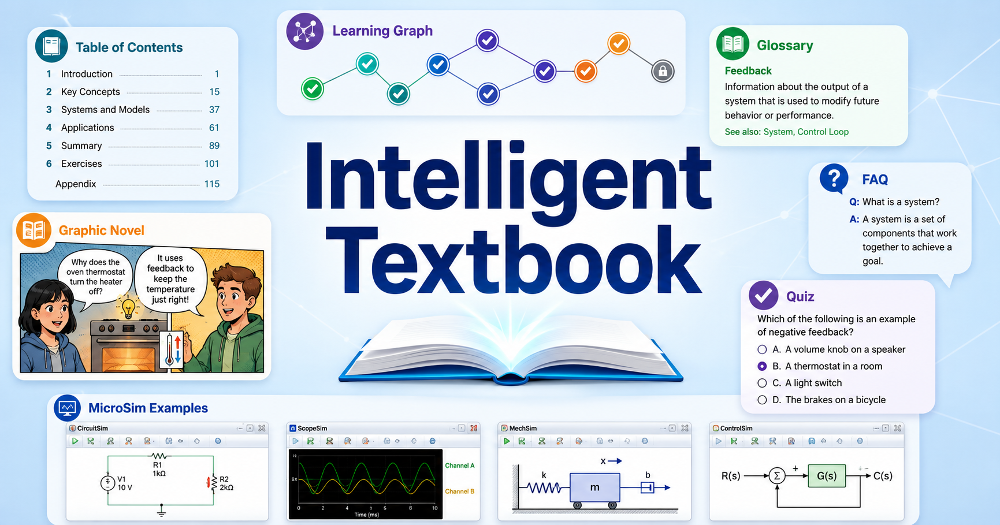

# Challenger Selling

[{ width="100%" }](chapters/01-challenger-methodology-insights/index.md)

**Challenger Selling** is an interactive textbook for sales professionals who
want to teach customers something new, tailor insights to different buyers, and
take control of complex sales conversations. It combines Challenger methodology
with memorable storytelling, practical case studies, and AI-assisted tools.

## Start Learning

Begin with [Chapter 1: Challenger Sales Methodology &
Insights](chapters/01-challenger-methodology-insights/index.md), then follow the
17-chapter sequence through storytelling psychology, buyer personas, objection
handling, AI-assisted story generation, measurement, and a capstone project.

- [Browse all chapters](chapters/index.md)
- [Practice with 50 interactive MicroSims](sims/index.md)
- [Explore the interactive learning graph](sims/graph-viewer/index.md)

## Find What You Need

- [About this book](about.md) — audience, approach, author, citation, and license
- [Course description](course-description.md) — prerequisites, topics, and learning outcomes
- [Glossary](glossary.md) — definitions for nearly 400 sales, storytelling, and AI concepts
- [Frequently asked questions](faq.md) — quick answers about the methods and tools
- [Book metrics](learning-graph/book-metrics.md) — chapters, concepts, simulations, quizzes, references, and word counts
- [Chapter metrics](learning-graph/chapter-metrics.md) — a chapter-by-chapter content summary

## What You Will Build

By the end of the book, you will have a portfolio of stories tailored to buyer
personas, industries, and objection patterns; a process for generating and
refining scenarios with AI; and a measurement framework for evaluating story
effectiveness. The final [capstone project](chapters/17-capstone-project/index.md)
brings these skills together in a complete story-based sales strategy.
