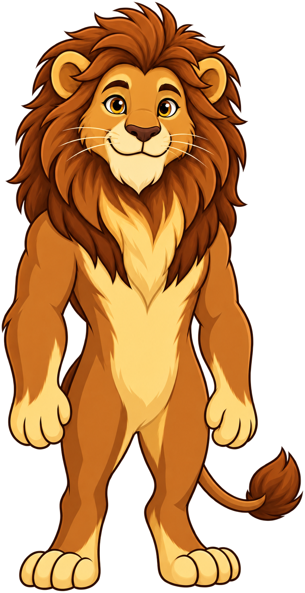

# Mascot Test Page

This page tests all seven mascot poses and validates the transparency/trim of each image.

## Mascot: Story the Lion

**Species:** Lion
**Personality:** Friendly, approachable, fun, playful, confident, strategic
**Catchphrase:** "Let's craft a story!"
**Colors:** Brown (#8B4513) and Gold (#FFD700)

## Pose Previews

### Neutral Pose (neutral.png)
General-purpose / default pose

```markdown
!!! note
    

    This is the neutral pose for Story the Lion. Used for general sidebars and inline content.
```

!!! note
    

    This is the neutral pose for Story the Lion. Used for general sidebars and inline content.

### Welcome Pose (welcome.png)
Chapter openings

```markdown
!!! tip
    

    Welcome to this chapter! Let's craft a story together.
```

!!! tip
    

    Welcome to this chapter! Let's craft a story together.

### Thinking Pose (thinking.png)
Key concepts and insights

```markdown
!!! info
    

    Think about this: What insight will teach your customer something new?
```

!!! info
    

    Think about this: What insight will teach your customer something new?

### Tip Pose (tip.png)
Hints and helpful guidance

```markdown
!!! success
    

    Pro tip: Start your story with a customer problem, not your product.
```

!!! success
    

    Pro tip: Start your story with a customer problem, not your product.

### Warning Pose (warning.png)
Common mistakes and pitfalls

```markdown
!!! warning
    

    Be careful: Don't make your story too complex. Keep it simple and memorable.
```

!!! warning
    

    Be careful: Don't make your story too complex. Keep it simple and memorable.

### Encouraging Pose (encouraging.png)
Difficult content and struggle

```markdown
!!! abstract
    

    You've got this! Challenger methodology takes practice, but the results are worth it.
```

!!! abstract
    

    You've got this! Challenger methodology takes practice, but the results are worth it.

### Celebration Pose (celebration.png)
Achievements and chapter completion

```markdown
!!! example
    

    Congratulations! You've mastered this chapter. Let's craft another story!
```

!!! example
    

    Congratulations! You've mastered this chapter. Let's craft another story!

## Validation Checklist

After generating your mascot images, verify:

- [ ] All 7 images are in `docs/img/mascot/`
- [ ] All images have fully transparent backgrounds (no white/black/checkered)
- [ ] Images are RGBA PNG format
- [ ] Images are trimmed to remove excess padding
- [ ] Mascot displays at correct size (90px) in admonitions
- [ ] All poses use consistent art style
- [ ] Colors match the character sheet (brown #8B4513, gold #FFD700)
- [ ] Mascot test page renders correctly

## Trim Padding Command

After saving your generated images, run this command to trim excess transparent padding:

```bash
python ~/Documents/ws/ibook-skills/src/image-utils/trim-padding-from-image.py docs/img/mascot/neutral.png
python ~/Documents/ws/ibook-skills/src/image-utils/trim-padding-from-image.py docs/img/mascot/welcome.png
python ~/Documents/ws/ibook-skills/src/image-utils/trim-padding-from-image.py docs/img/mascot/thinking.png
python ~/Documents/ws/ibook-skills/src/image-utils/trim-padding-from-image.py docs/img/mascot/tip.png
python ~/Documents/ws/ibook-skills/src/image-utils/trim-padding-from-image.py docs/img/mascot/warning.png
python ~/Documents/ws/ibook-skills/src/image-utils/trim-padding-from-image.py docs/img/mascot/celebration.png
python ~/Documents/ws/ibook-skills/src/image-utils/trim-padding-from-image.py docs/img/mascot/encouraging.png
```

This script trims transparent padding to the bounding box of the visible content, ensuring the mascot displays at the intended size.
